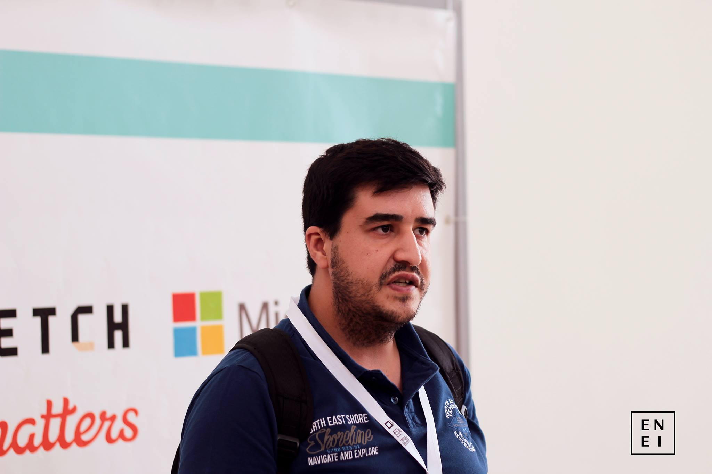
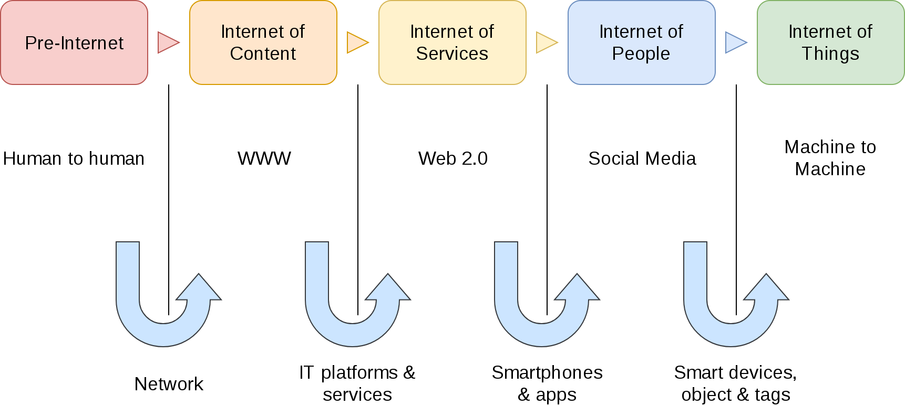
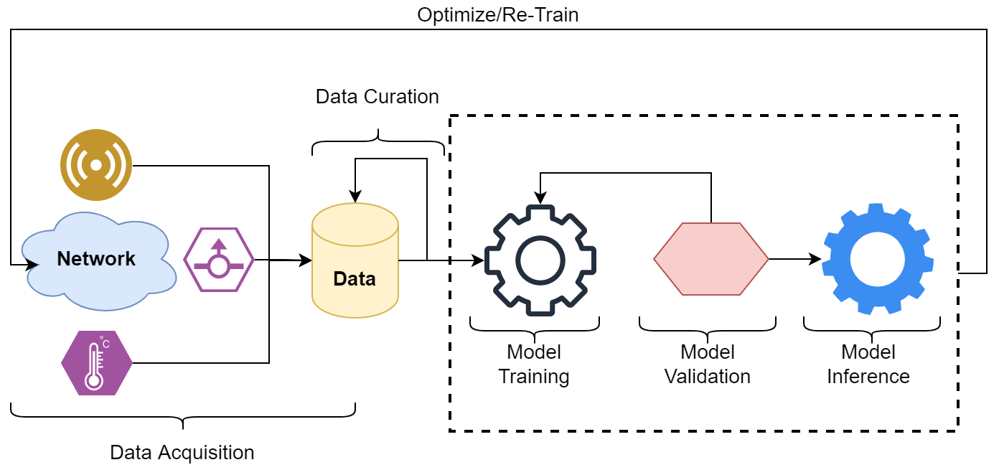

# Professor

::: columns

:::: column
- **Name:** Mário Antunes
- **E-Mail:** [mario.antunes@ua.pt](mailto:mario.antunes@ua.pt)
- **Office:** 19.2.15 (IT1)
::::

:::: column

::::

:::

# Class Introduction

::: columns

:::: column
- Given the evolution of the threats
- And the complexity of the systems
- AI/ML are gaining traction as a usefull tool
::::

:::: column

::::

:::

# Class Introduction

# Class Introduction

# Grading

- 50% Theory + 50% Practice 
- Discrete: 25% Mid-term Exam + 25% Final Exam + 20% Project Idea + 30% Project
- Final: 50% Final Exame + 50% Project 

# Class Schedule

| Date       | Class | Topic             |
|------------|-------|-------------------|
| 15/09/2023 | 1     | Introduction      |
| 22/09/2023 | 2     | SPAM Detector     |
| 29/09/2023 | 3     |
| 06/10/2023 | 4     |
| 13/10/2023 | 5     | Anomaly Detection |
| 20/10/2023 | 6     |
| 27/10/2023 | 7     |
| 03/11/2023 | 8     | Mid-term Exam     |
| 10/11/2023 | 9     | Malware Analysis  |
| 17/11/2023 | 10    |
| 24/11/2023 | 11    |
| 01/12/2023 | 12    | Project           |
| 08/12/2023 | 13    |
| 15/12/2023 | 14    |
| 22/12/2023 | 15    |

# Environment

# Bibliography

All of the books are available here: [https://learning.oreilly.com/](https://learning.oreilly.com/)
