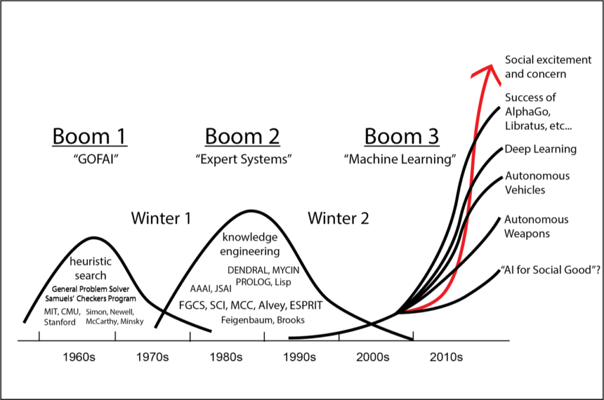
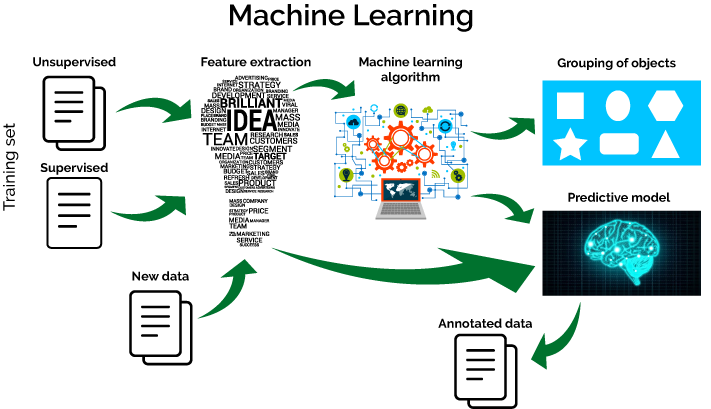
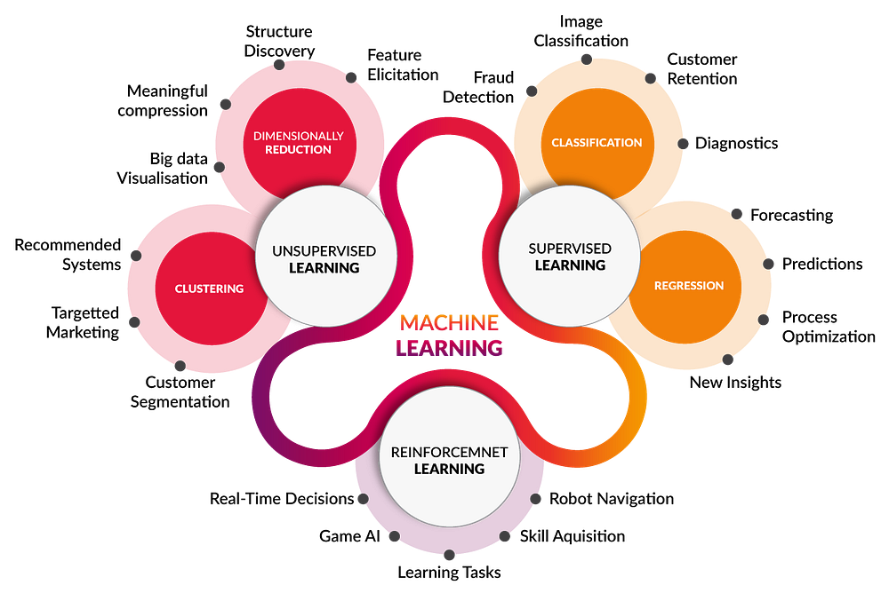
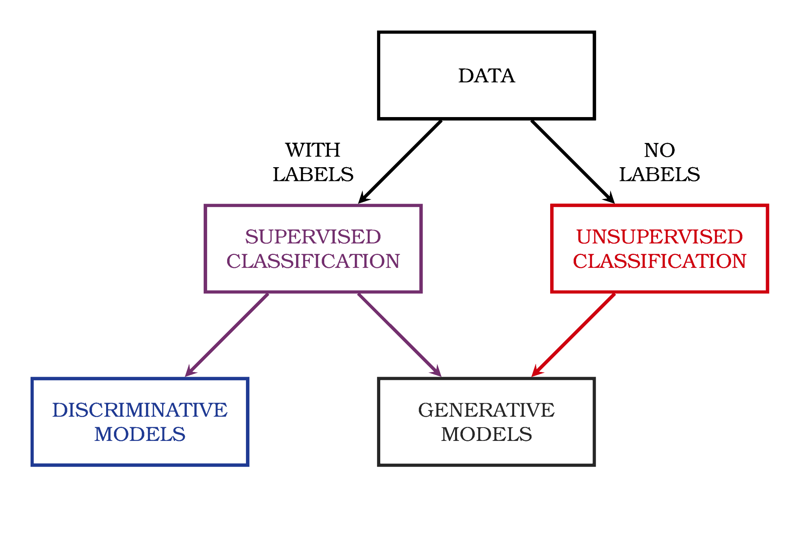
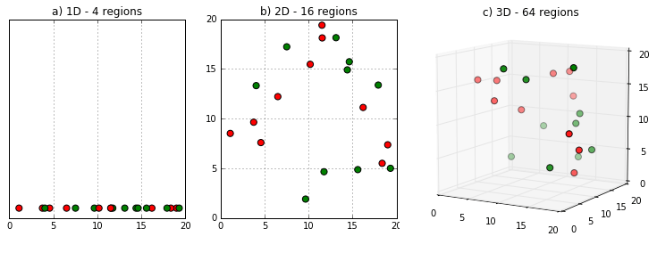
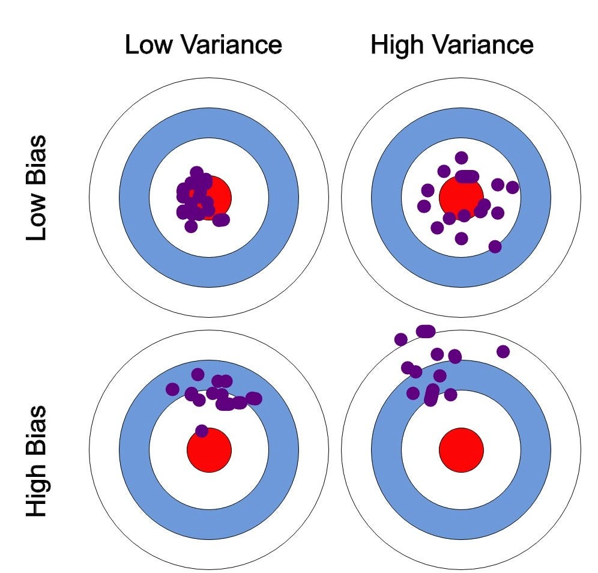

# Machine Learning

## AI/ML

This graph shows the history of Artificial Intelligence, often described in "waves" of progress and excitement, followed by "AI winters" where funding and interest dried up.

---

* **1960s (GOFAI):** This was "Good Old-Fashioned AI." It was based on the idea that human intelligence could be replicated using symbolic logic and formal rules.
    * **Heuristic Search:** A key part of GOFAI, these are algorithms designed to find a "good enough" solution to complex problems, like finding the best path in a maze or a game like chess.
* **1970s-1980s (Expert Systems):** This wave focused on building systems with "Knowledge Engineering." Developers would manually encode the knowledge of a human expert (e.g., a doctor or geologist) into a massive set of "IF-THEN" rules.

---

* **1990s (Machine Learning):** A shift occurred. Instead of programmers *manually* writing the rules, systems were built to *learn* the rules themselves by finding patterns in large datasets.
* **2000s-2010s (Modern AI):** This is the current wave, driven by the rise of Big Data, powerful computing (GPUs), and advanced ML techniques.
    * **Deep Learning:** A subfield of ML that uses "deep" neural networks (with many layers) to solve highly complex problems like image and speech recognition.
    * **Autonomous Vehicles** and **AI for Social Good** are major applications, leading to the current high peak of "social excitement and concern."

# What is ML (Why should I Care)?

## What is ML 

**What does machine learning mean?**

At its core, **Machine Learning (ML)** is the capability of a machine to improve its own performance on a task without being explicitly programmed for that task.

* **Traditional Programming:** You write explicit, step-by-step rules (e.g., `IF email_subject contains "viagra" THEN mark_as_spam`). This is brittle and hard to maintain.

---

* **Machine Learning:** You show the machine thousands of examples of spam and non-spam emails. It *learns* the patterns and builds its own statistical model to make a decision.

When it gets a new email, it uses this model to make a prediction (spam or not spam). It can then incorporate the result of that trial (was it right or wrong?) back into the model to continuously improve, essentially learning from trial and error.

## The Machine Learning Process i 

## The Machine Learning Process ii

Building a useful ML model involves a standard workflow, which is highly iterative:

* **Step 1: Gathering data**
    This is the foundation. Data must be collected from various sources, such as databases, files, APIs, or real-time sensors (IoT). The quality and quantity of your data will determine the ceiling of your model's performance.
* **Step 2: Cleaning data (Data Preprocessing)**
    Raw data is always messy. This step, which is often the most time-consuming, involves fixing errors, handling missing values, removing duplicates, and standardizing data to have *homogeneity*.

---

* **Step 3: Model Building**
    This involves:
    1.  **Splitting** your data into a *training set* (to teach the model) and a *test set* (to evaluate it).
    2.  **Selecting** the right ML algorithm (e.g., Linear Regression, Decision Tree, Neural Network) based on your problem.
    3.  **Training** the model by feeding it the training data.
* **Step 4: Gaining insights (Model Evaluation)**
    Once the model is trained, you use the *test set* (which the model has never seen before) to see how it performs. This involves checking metrics like accuracy, precision, etc., to understand its strengths and weaknesses.
* **Step 5: Data Visualization**
    After evaluation (and often during the initial data exploration), you transform results and data into visual graphs. This is crucial for understanding complex patterns and communicating your findings to stakeholders.

## What is ML 

This diagram shows the flow of data in ML:

---

1.  **Training Set:** You start with data. This data can be **Unsupervised** (just raw data with no "answers") or **Supervised** (data that includes predefined "answers" or labels).
2.  **Feature Extraction:** You can't just feed raw data (like an image or text) into most models. This step involves selecting or engineering the most relevant input variables (features) for the model to learn from. For example, for text, features might be word counts or topics.

---

3.  **Machine Learning Algorithm:** This is the "brain" of the operation. The algorithm (e.g., K-Means, SVM, Neural Network) processes the features from the training set to find patterns.
4.  **Outputs:**
    * An **Unsupervised** task might result in **Grouping of objects** (clustering).
    * A **Supervised** task results in a **Predictive model** (like a classifier or regressor).
5.  **Usage:** This trained *Predictive model* can then be used to analyze **New data** and produce **Annotated data** (i.e., new data with a predicted label or value).

---

## Taxonomy i

Machine learning is broadly categorized into three main types.

### 1. Supervised Learning
The model learns from data that is already **labeled with the correct answer**. It's like learning with a teacher or an answer key.

* **Classification:** Predicts a category (discrete label).
    * *Examples:* Is this email spam or not? (Logistic Regression, SVM), Will a customer churn or not? (Decision Trees), What object is in this image? (Naive-Bayes, KNN).
* **Regression:** Predicts a continuous value (a number).
    * *Examples:* What will the price of this house be? (Linear Regression), What will the temperature be tomorrow? (Polynomial Regression).

---

### 2. Unsupervised Learning
The model learns from data that is **unlabeled**. Its goal is to find hidden structures or patterns in the data on its own.

* **Clustering:** Groups data points that are similar to each other.
    * *Examples:* Segmenting customers into different purchasing groups (K-Means), Grouping similar news articles.
* **Association Analysis:** Discovers rules that describe large portions of your data.
    * *Examples:* "Customers who buy diapers also tend to buy beer" (Apriori, FP-Growth).
* **Dimensionality Reduction:** Simplifies data by reducing the number of features.
    * *Examples:* SVD, PCA.

---

### 3. Reinforcement Learning
The model learns by interacting with an environment. It receives "rewards" for good actions and "penalties" for bad ones, learning through trial and error.

* *Examples:* Training a bot to play a game (like chess or Go), a self-driving car learning to stay in its lane, robotic control systems.

## Taxonomy ii

## What is ML useful for?

::: columns

:::: column
* It's a **body of knowledge** and a set of methods related to how computers can learn from data.
* It's a massive **research area** spanning computer science, statistics, and neuroscience.
* It presents huge **opportunities** to build useful, adaptive, and intelligent systems.
::::

:::: column

::::

:::

## Why Should You Care?

This diagram shows the evolution of the internet and data generation:

---

* **Pre-Internet:** Communication was **Human to human**, supported by basic networks.
* **Internet of Content (WWW):** We published and consumed static content.
* **Internet of Services (Web 2.0):** The web became interactive. We used IT platforms, services, smartphones, and apps.
* **Internet of People (Social Media):** Humans became the primary content generators, creating vast networks of social data.
* **Internet of Things (IoT):** Now, **Machine to Machine** communication is exploding. Smart devices, objects, and tags are generating an unimaginable volume of real-time data.

---

**The connection to ML:** This massive, constant flood of data (Big Data) from IoT and social media is far too large and fast for humans to analyze manually. Machine learning is the *only* toolset available that can sift through this data in real-time to find patterns, make predictions, and automate intelligent actions.

# Taxonomy

## Taxonomies

This is a simplified breakdown of the main ML categories.

* **ML**
  - **Supervised (Needs Labeled Data)**
    * **Regression:** Predict a numerical value (e.g., price).
    * **Classification:** Predict a category (e.g., cat/dog).
  - **Unsupervised (Uses Unlabeled Data)**
    * **Clustering:** Find natural groupings in data (e.g., customer segments).
    * **Blind Signal Separation:** A more advanced task, like separating individual voices from a single recording of a crowded room (the "cocktail party problem").

## Taxonomies

This chart shows another key way to classify models, particularly within supervised learning.

::: columns

:::: column

::::

:::: column

::::

:::

---

Models can be further broken down into:

* **Discriminative Models:** These models learn the **decision boundary** *between* different classes. They answer the question, "What is the difference between class A and class B?"
  - *Example:* A discriminative model would find the line that best separates the blue dots from the red dots. (e.g., Logistic Regression, Support Vector Machines).
* **Generative Models:** These models learn the underlying data distribution *of each class independently*. They answer the question, "What does class A look like?" and "What does class B look like?"
  - Because they "understand" what the data looks like, they can be used to *generate* new, synthetic examples (like creating new images of faces). (e.g., Naive Bayes, GANs).

## Taxonomies

* **Induction symbolic reasoning:** Learns by creating a set of human-readable logical rules (e.g., Decision Trees, which produce IF-THEN rules).
* **Neural Networks:** Models inspired by the structure of the human brain, using interconnected nodes ("neurons") in layers to learn complex patterns.
* **Evolutionary algorithms:** Uses concepts from Darwinian evolution, like selection, mutation, and crossover, to "evolve" a population of potential solutions toward an optimal one (e.g., Genetic Algorithms). 

---

* **Bayesian inference:** Based on probability (specifically Bayes' Theorem). These models update their "beliefs" (probabilities) about a situation as new evidence or data becomes available.
* **Analogy:** Learns by storing known examples and making predictions for new examples by finding the *most similar* ones in its memory (e.g., k-Nearest Neighbors, or KNN).

# Limitations

## Curse of Dimensionality

These images illustrate one of the biggest problems in machine learning, the **"Curse of Dimensionality."**

---

* In **1 Dimension ($D=1$)**, you only need a few data points to cover a line.
* In **2 Dimensions ($D=2$)**, you need exponentially more data points to cover a square.
* In **3 Dimensions ($D=3$)**, you need even more to fill a cube.

As you add more **features** (dimensions) to your dataset, the "volume" of the space grows exponentially. Your data becomes very sparse, and it becomes much, much harder for an algorithm to find meaningful patterns.

## Simplification of reality

* **Our model is a simplification of reality.**
    The real world is infinitely complex. We can't capture all of it. A weather model doesn't (and can't) track the motion of every single atom.

* **Simplification is based on assumptions (model bias).**
    To simplify reality, we must make assumptions. For example, a **Linear Regression** model *assumes* that the relationship between the inputs and the output is a straight line. This built-in assumption is the model's **bias**.

* **Assumptions fail in certain situations.**
    If you use that Linear Regression model to describe a complex, curved, non-linear phenomenon (like a stock price), your assumption is wrong. The model will fail because its bias (its assumption of a straight line) doesn't match reality. This is also known as **underfitting**.

## Bias and Variance

The diagram of targets illustrates it perfectly. Imagine the bullseye is the "true" pattern in the data you want your model to learn.

{ width=50% }

---

* **Low Bias, Low Variance (Ideal):**
    Your predictions are accurate (low bias) and consistent (low variance). You are hitting the bullseye every time. This is the goal.
* **Low Bias, High Variance (Overfitting):**
    Your predictions are accurate *on average* but are all over the place. The model is too complex; it has learned the *noise* in the training data, not just the "signal." It's like a shaky shooter who is aiming at the bullseye but whose hand is unsteady. It will do well on data it has seen, but poorly on new, unseen data.

---

* **High Bias, Low Variance (Underfitting):**
    Your predictions are very consistent, but they are consistently *wrong*. The model is too simple. It has failed to capture the underlying pattern. It's like a shooter with a perfectly steady hand but a misaligned rifle sight—they hit the same spot every time, but it's not the bullseye.
* **High Bias, High Variance (Worst Case):**
    Your predictions are inaccurate and inconsistent. The model is just plain wrong.

# Terminology

## Terminology

* **Dataset:** The entire spreadsheet file. It's the complete collection of your data.
* **Example:** A single **row** in the spreadsheet. It represents one complete observation or instance (e.g., one customer, one email, one house).
* **Feature:** A single **column** in the spreadsheet. It is a single property of an example (e.g., 'Age', 'Height', 'Income', 'Zip Code'). These are the **input variables** (often called $x$) that the model uses to make a prediction.
* **Label:** The special "answer" column you are trying to predict. It is the classification or output variable (e.g., 'Purchased Item?', 'Is Spam?', 'Price'). This is the **output variable** (often called $y$).
    - (In unsupervised learning, you do not have a label column).