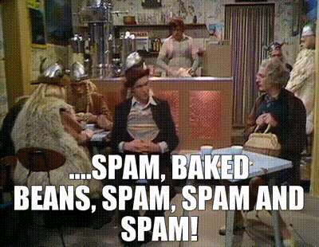
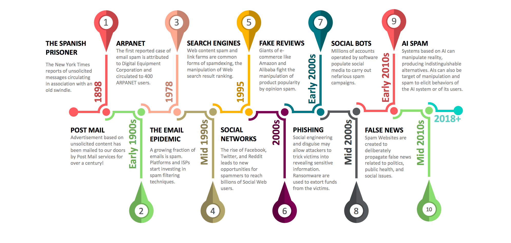
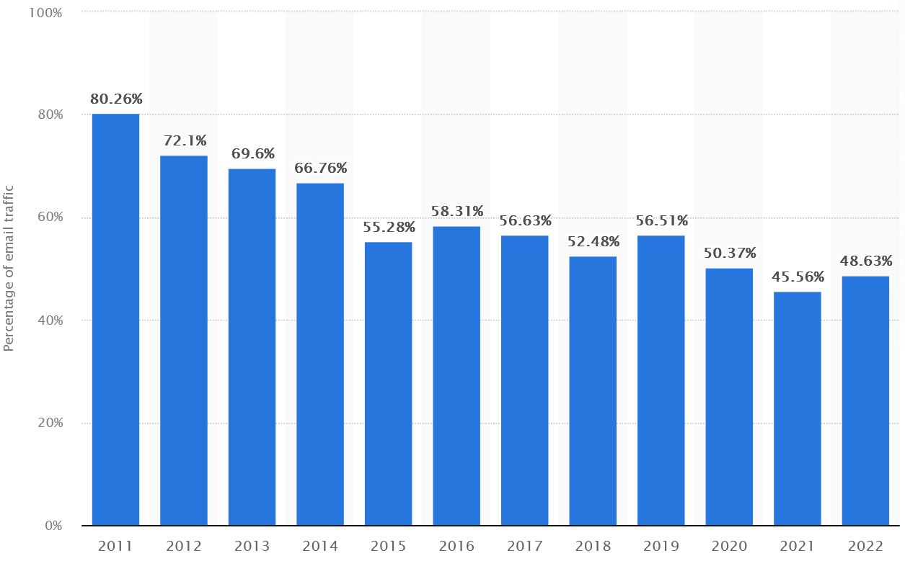
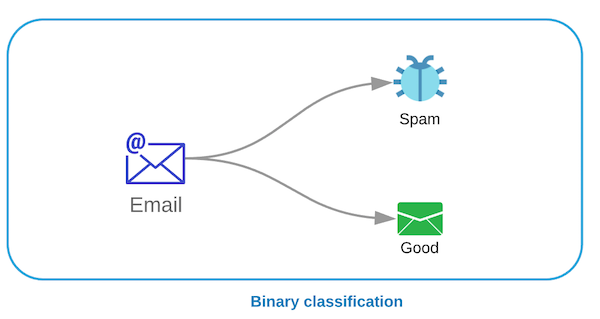
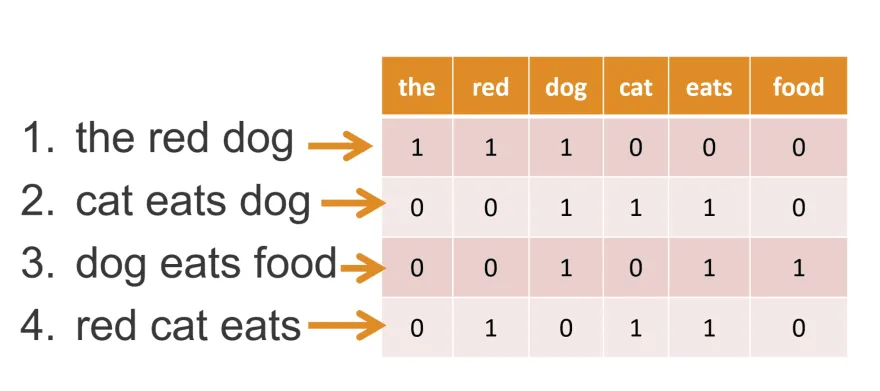
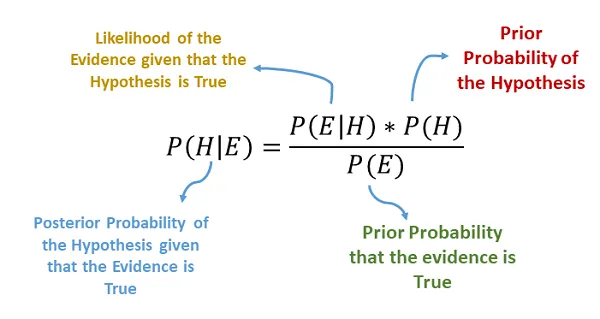
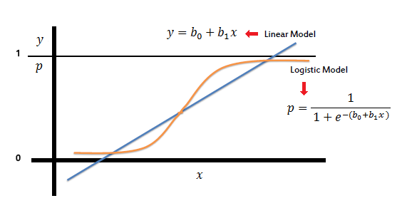
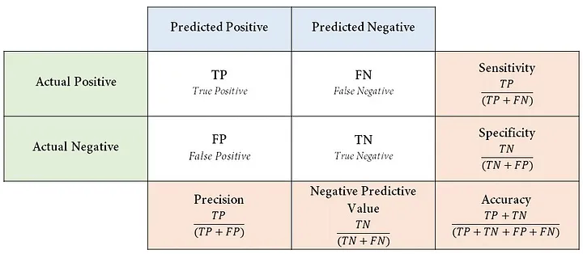
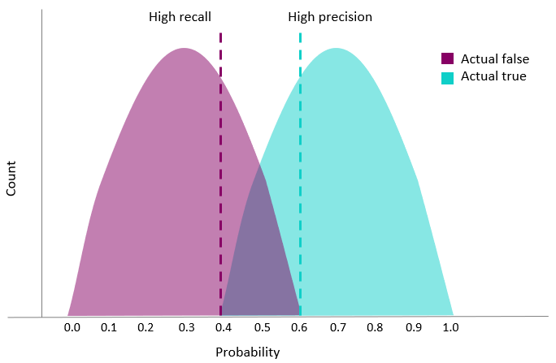

# SPAM

## SPAM

* The term "spam" is internet slang that refers to unsolicited commercial email (UCE).
* The first reported case of spam occurred in 1898, when the New York Times reported unsolicited messages circulating in association with an old swindle.
* The term "spam" was coined in 1994, based on a now-legendary Monty Python's Flying Circus sketch, where a crowd of Vikings sings progressively louder choruses of "SPAM! SPAM! SPAM!"

## SPAM

## SPAM

## SPAM

# Fight against SPAM

## Fight against SPAM

* *Huge* list of [anti-spam techniques](https://en.wikipedia.org/wiki/Anti-spam_techniques)
* From common sense to *Bayesian spam filtering*
* Unfortunately it is a costly battle

## Fight against SPAM

# SPAM Detection 

## SPAM Detection

# Binary Classification

## Binary Classification

* Binary classification is the task of classifying the elements of a set into two groups (each called class) on the basis of a classification rule. 
* For this application one message can either be spam or ham. 

{ width=75%}

# Text Mining 

## Text Mining

* Text mining is the process of deriving high-quality information from text. 
* Combines concepts from Machine Learning, Linguistic and statistical analysis. 
* In this area we will explore the methods used to rank words/tokens and the BoW model.

## Bag of Words (Bow) model

# Natural Language Processing (NLP)

## Natural Language Processing (NLP)

* NLP gives the computers the ability to understand text. 
* Combines *Sintax* and *Semantic* into the analysis.
* One famous exemples are the Large Language Models (LLMs) that power OpenAI Chat GPT. 

# Classification Model 

## Classification Model

* SPAM detection is "considered" a toy example.
* As such, we will explore two of the simples learning models: Naive Bayes and Logistic Regression.

:::: {.columns}
::: {.column width="50%"}

:::
::: {.column width="50%"}

:::
::::

# Model Evaluation 

## Model Evaluation

* Classification model can be evaluated using a confusing matrix
* The simplest methods to evaluate a model is throuhgh accuracy: $acc = \frac{TP+TN}{TN+TN+FP+FN}$

## Model Evaluation

