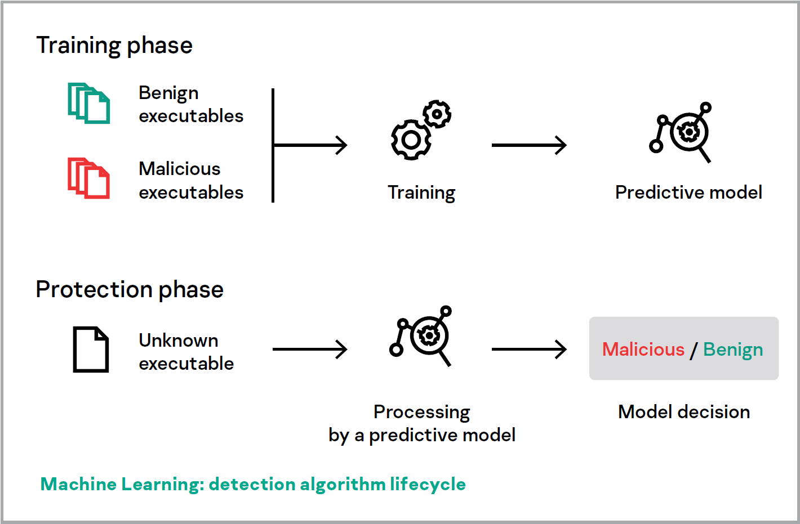
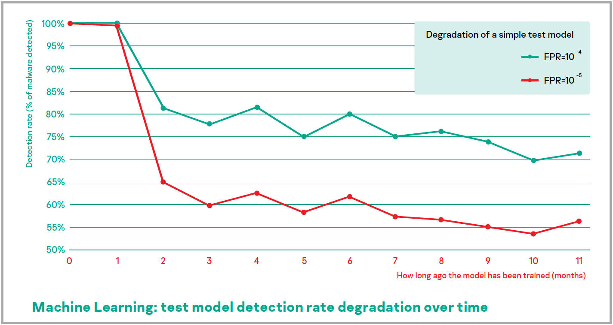
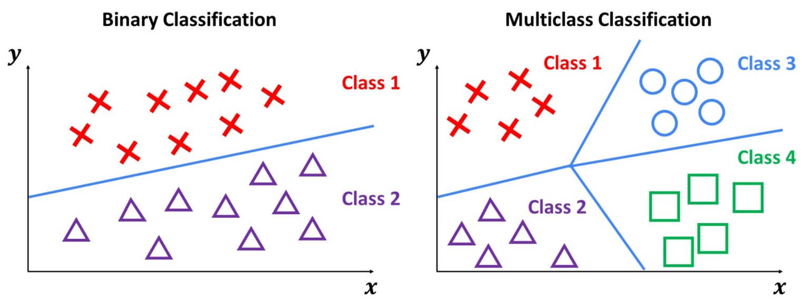

# Context

## Context

Malware, or malicious software, is any program or file that is intentionally harmful to a computer, network or server.

Malware can infect networks and devices and is designed to harm those devices, networks and/or their users in some way.

Depending on the type of malware and its goal, this harm may present itself differently to the user or endpoint. In some cases, the effect malware has is relatively mild and benign, and in others, it can be disastrous.

## Creeper virus (1971)

Computer pioneer John von Neumann's posthumous work Theory of Self-Reproducing Automata, was published in 1966. Five years later, the first known computer virus, called Creeper, was a written by Bob Thomas. Written in PDP-10 assembly language, Creeper could reproduce itself and move from computer to computer across the nascent ARPANET.

Creeper did no harm to the systems it infected - Thomas developed it as a proof of concept, and its only effect was that it caused connected teletype machines to print a message that said "I'M THE CREEPER: CATCH ME IF YOU CAN."

## ILOVEYOU worm (2000)

Onel de Guzman crafted his creation with straightforward criminal intent: he couldn’t afford dialup service, so he built a worm that would steal other people’s passwords so he could piggyback off of their accounts.

But the malware so cleverly took advantage of a number of flaws in Windows 95 that it spread like wildfire, and soon millions of infected computers were sending out copies of the worm and beaming passwords back to a Filipino email address.

de Guzman was never charged with a crime, because nothing he did was illegal in the Philippines at the time, but he expressed regret in an interview 20 years later, saying he never intended the malware to spread as far as it did.

## CryptoLocker ransomware (2013)

CryptoLocker became famous for its rapid spread and its powerful asymmetric encryption that was (at the time) uniquely difficult to break. 

It also became famous due to something unusual in the malware world: a happy ending. In 2014, the U.S. DoJ and peer agencies overseas managed to take control of the Gameover Zeus botnet, and restore the files of CryptoLocker victims free of charge. Unfortunately, CryptoLocker spread via good old-fashioned phishing as well, and variants are still around.

## Mirai botnet (2016)

Internet of Things (IoT) devices are omnipresent, ignored, and often go unpatched for years. The Mirai botnet was actually similar to some of the early malware we discussed because it exploited a previously unknown vulnerability and wreaked far more havoc than its creator intended.

In this case, the malware found and took over IoT gadgets (mostly CCTV cameras) that hadn’t had their default passwords changed. Paras Jha, the college student who created the Mirai malware, intended to use the botnets he created for DoS attacks that would help settle scores in the obscure world of Minecraft server hosting, but instead he unleashed an attack that focused on a major DNS provider and cut off much of the U.S. east coast from the internet for the better part of a day.

## Clop ransomware (2019-Present)

Clop (sometimes written Cl0p) is another ransomware variant that emerged on the scene in 2019 and has grown increasingly prevalent since. In addition to preventing victims from accessing their data, Clop allows the attacker to withdraw that data as well. 

What makes Clop so interesting and dangerous, however, is not how it’s deployed, but by whom. It’s at the forefront of a trend called Ransomware-as-a-Service, in which a professionalized group of hackers does all the work for whoever will pay them enough (or share in a percentage of the ransomware riches they extract from victims).

# How To Recognize Malware

## How To Recognize Malware

1. **Signature-based detection:** Signature-based detection uses known digital indicators of malware to identify suspicious behavior. Lists of indicators of compromise (IOCs) can be used to identify a breach. While IOCs can be effective in identifying malicious activity, they are reactive in nature.

2. **Static file analysis:** Examining a file's code, without running it, to identify signs of malicious intent. File names, hashes, strings such as IP addresses, and file header data can all be evaluated to determine whether a file is malicious.

## How To Recognize Malware #2

3. **Dynamic malware analysis:** Dynamic malware analysis executes suspected malicious code in a safe environment called a sandbox. This closed system enables security professionals to watch and study the malware in action without the risk of letting it infect their system or escape into the enterprise network.

4. **Dynamic monitoring of mass file operations:** Observing mass file operations such as rename or delete commands to identify signs of tampering or corruption. Dynamic monitoring often uses a file integrity monitoring tool to track and analyze the integrity of file systems through both reactive forensic auditing and proactive rules-based monitoring.

## How To Recognize Malware #3

5. **File extensions blocklist:** File extensions are letters occurring after a period in a file name, indicating the format of the file. This classification can be used by criminals to package malware for delivery. As a result, a common security method is to list known malicious file extension types in a "blocklist" to prevent unsuspecting users from downloading or using the dangerous file.

6. **Application allowlist:** The opposite of a blocklist/blocklisting, where an organization authorizes a system to use applications on an approved list. Allowlisting can be very effective in preventing nefarious applications through rigid parameters. However, it can be difficult to manage and reduce an organization’s operational speed and flexibility.

## How To Recognize Malware #4

7. **Malware honeypot:** A malware honeypot mimics a software application or an application programming interface (API) to draw out malware attacks in a controlled, non-threatening environment. Similarly, a honeypot file is a decoy file to draw and detect attackers. In doing so, security teams can analyze the attack techniques and develop or enhance antimalware solutions to address these specific vulnerabilities, threats or actors.

8. **Cyclic redundancy check (CRC):** A calculation on a collection of data, such as a file, to confirm its integrity. One of the most common checksums used is a CRC, which involves analysis of both value and position of a group of data. Checksumming can be effective for identifying corruption in data but is not foolproof for determining tampering.

## How To Recognize Malware #5

9. **File entropy:** As threat intelligence and cybersecurity evolves, adversaries increasingly create dynamic malware executables to avoid detection. This results in modified files that have high entropy levels. As a result, a file’s data change measured through entropy can identify potential malware.

10. **Machine learning analysis:** Machine learning (ML) is a subset of artificial intelligence (AI), and refers to the process of teaching algorithms to learn patterns from existing data to predict answers on new data. This technology can analyze file behavior, identify patterns and use these insights to improve detection of novel and unidentified malware.

# Malware Detection

## Malware Detection

An efficient, robust and scalable malware recognition module is the key component of every cybersecurity product.
Malware recognition modules decide if an object is a threat, based on the data they have collected on it. 
This data may be collected at different phases:

- Pre-execution phase data is anything you can tell about a file without executing it. This may include executable file format descriptions, code descriptions, binary data statistics, text strings and information extracted via code emulation and other similar data.

- Post-execution phase data conveys information about behavior or events caused by process activity in a system.

## Malware Detection #2

In the early part of the cyber era, the number of malware threats was relatively low, and simple manually created pre-execution rules were often enough to detect threats.

The rapid rise of the Internet and the ensuing growth in malware meant that manually created detection rules were no longer practical - and new, advanced protection technologies were needed.

Today, machine learning boosts malware detection using various kinds of data on host, network and cloud-based anti-malware components.

## Machine learning Approaches

### Unsupervised learning

The goal is to discover the structure of the data or the law of data generation.
 
Large unlabeled datasets are available to cybersecurity vendors and the cost of their manual labeling by experts is high – this makes unsupervised learning valuable for threat detection.

## Machine learning Approaches #2

### Supervised learning

Supervised learning is a setting that is used when both the data and the right answers for each object are available.
The goal is to fit the model that will produce the right answers for new objects.

Supervised learning consists of two stages:

- **Training** a model and fitting a model to available training data.

- **Applying** the trained model to new samples and obtaining predictions.

## Machine learning Approaches #3

This training information is utilized during the training phase, when we search for the best model that will produce the correct label Y for previously unseen objects given the feature set X.

In the case of malware detection, X could be some features of file content or behavior, for instance, file statistics and a list of used API functions. Labels Y could be malware or benign, or even a more precise classification, such as a virus, Trojan-Downloader or adware.

After we have trained a model and verified its quality, we are ready for the next phase – applying the model to new objects. In this phase, the type of the model and its parameters do not change. The model only produces predictions.

## Machine learning Approaches #4

# Requirements

## Requirements

### Deep learning

Deep learning is a special machine learning approach that facilitates the extraction of features of a high level of abstraction from low-level data. Deep learning has proven successful in computer vision, speech recognition, natural language processing and other tasks.

A deep learning model can learn complex feature hierarchies and incorporate diverse steps of malware detection pipeline into one solid model that can be trained end-to-end, so that all of the components of the model are learned simultaneously.

## Requirements #2

### Large representative datasets are required

It is important to emphasize the **data-driven** nature of this approach. A created model depends heavily on the data it has seen during the training phase to determine which features are statistically relevant for predicting the correct label.

We must train our models on a data set that correctly represents the conditions where the model will be working in the real world. This makes the task of collecting a **representative dataset** crucial for machine learning to be successful.

## Requirements #3

### The trained model has to be interpretable (XAI)

Most of the model families used currently, like deep neural networks, are called **black box models.** Black box models are given the input X, and they will produce Y through a complex sequence of operations that can hardly be interpreted by a human.

For example, when a false alarm occurs, and we want to understand why it happened, we ask whether it was a problem with a training set or the model itself. The **interpretability** of a model determines how easy it will be for us to manage it, assess its quality and correct its operation.

## Requirements #4

### False positive rates must be extremely low

False positives happen when an algorithm mistakes a malicious label for a benign file. Our aim is to make the false positive rate as low as possible. This is complicated by the fact that there are lots of clean files in the world, and they keep appearing.

To address this problem, it is important to impose high requirements for both machine learning models and metrics that will be optimized during training, with the clear focus on low false positive rate (FPR) models.

## Requirements #5

### Models adaptability

Outside the malware detection domain, machine learning algorithms regularly work under the assumption of **fixed data distribution**, which means that it doesn't change with time. When we have a training set that is large enough, we can train the model so that it will effectively reason any new sample in a test set. As time goes on, the model will continue working as expected.

## Requirements #6

### Models adaptability

After applying machine learning to malware detection, we have to face the fact that our data distribution isn't fixed:

- Active adversaries (malware writers) constantly work on avoiding detections and releasing new versions of malware files that differ significantly from those that have been seen during the training phase.

- Thousands of software companies produce new types of benign executables that are significantly different from previously known types. The data on these types was lacking in the training set, but the model, nevertheless, needs to recognize them as benign.

## Requirements #6

### Models adaptability

# Multi-Class Classification

## Multi-Class Classification

In machine learning and statistical classification, multiclass classification or multinomial classification is the problem of classifying instances into one of three or more classes (classifying instances into one of two classes is called binary classification).

## Multi-Class Classification #2

### One-Vs-Rest (One-Vs-All)

It involves splitting the multi-class dataset into multiple binary classification problems. A binary classifier is then trained on each binary classification problem and predictions are made using the model that is the most confident.

- Binary Classification Problem 1: red vs [blue, green]

- Binary Classification Problem 2: blue vs [red, green]

- Binary Classification Problem 3: green vs [red, blue]

## Multi-Class Classification #3

### One-Vs-One

The formula for calculating the number of binary datasets, and in turn, models, is as follows: $(NumClasses * (NumClasses – 1)) / 2$
Each binary classification model may predict one class label and the model with the most predictions or votes is predicted by the one-vs-one strategy.

- Binary Classification Problem 1: red vs. blue
- Binary Classification Problem 2: red vs. green
- Binary Classification Problem 3: red vs. yellow
- Binary Classification Problem 4: blue vs. green
- Binary Classification Problem 5: blue vs. yellow
- Binary Classification Problem 6: green vs. yellow
